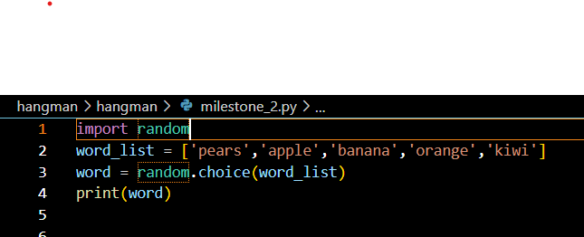

# Project  Hangman

Hangman is a classic game in which a player thinks of a word and the other player tries to guess that word within a certain amount of attempts.
This is an implementation of the Hangman game, where the computer thinks of a word and the user tries to guess it. 

## Milestone 1

>  Setting up the environment
- To clone this repository, *copy and paste the following code in your terminal* ```git clone https://github.com/Imaduddin-Mohammed/hangman.git```

## Milestone 2
 
> Initialized variables for the game

### Task 1
- Created file called milestone_2.py in the hangman folder which contains the code for the first milestone, a variable called **word list** is initialized to a list of fruits as shown below.
```python
word_list = ['pears','apple','banana','orange','kiwi']
```
### Task 2
- Using the random module of python, I have generated a random output from the list upon each time it is passed in the *print()* function and saving the output to a variable called **word**.



### Task 3 
- *input()* function is used to ask the user for an input of string which contains only single letter of alphabet
```python 
guess = input('Enter a single letter')
```
### Task 4 
- For checking that the user input is a single character, **if() else()** statements are used that uses **isalpha()** method to validate the input string is an alphabet and **Length()** which checks length is equal to 1.
```python
if len(guess) == 1 and guess.isalpha():
    print("Good guess")
else:
    print("Oops! That is not a valid input.")
```
### Task 5 
- Documenting/Describing all the code in detail to the README.md
### Task 6
- Uploaded all the changes to github repository.

## Milestone 3
> Checking if the guessed character is in the word
### Task 1 
- Created check guess function which takes in an argument and checks if the guessed letter is in the randomly guessed output which is saved in 'word' variable.
```python
def check_guess():
if guess in milestone_2.word:
     print("Good guess! {} is in the word.".format(guess))
else:
     print("Sorry, {} is not in the word".format(guess))
```
### Task 2
- created a function named ask_for_input() which as the name suggests asks the user to enter input and checks if the input is valid. 
- This class has a while loop which iteratively asks the user for a letter
```python
    while True:
        guess = input("Guess a letter: ")
```
- To ensure that the letter is of length 1 and an alphabet, I have utilized the **len()** and **isalpha()** method as shown below:
```python
if len(guess) == 1 and guess.isalpha():
    break
else: 
    print("Invalid letter, Enter a single character alphabet")
```
- Once the if block is True, towards the end of the function **check_guess()** function is called by passing the guess, which will evaluate if the input is in the  word.

## Milestone 4
> Created milestone_4.py which contains the game class which now contains the functions from milestone 2 and milestone 4 
### Task 1
- Hangman class and its constructor and attributes are defined
### Task 2
- Copied the entire code from milestone 2 and milestone 3 which will become methods of this class
### Task 3 
- Check guess method is updated to replace the underscores '_' in word_guessed list with the letter guessed by the user
- A for-loop that will loop through each letter in the word
- An if block is created to check if the letter = guess
- If this is true, A for loop iterates through each idx and letter using an enumerate keyword as shows in below code:
```python
for i, letter in enumerate(self.word)
if letter == guess:
self.word_guessed[i] = letter
self.num_letters -= 1 
```
- If the letter is equal to the guess then the word_guessed list at that index is updated by guess and num_letters is reduced by 1
- If the letter is not equal to guess, num_lives are reduced by 1 and the following message is printed 
> Sorry! {guess} is not in the word
> You have {num_lives} lives left! 

## Milestone 5
> Putting it all together
 - Coding the logic of the game by
- Created milestone_5.py file which will contains all the code from milestone_4 and the code that is required to play this game
- A function is defined called play_game which takes in word_list as an argument
- An instance of Hangman class is created which is called game
- A while loop is set to True that iterates through the following code
```python
 
        if game.num_lives == 0:
            print("You lost!")
            break

        elif game.num_letters > 0:
            game.ask_for_input()  

        elif game.num_lives != 0 and game.num_letters == 0:
            print("Congratulation you won the game!")
            break
 ```
- If block checks if the number of lives is zero, if it is, The game is over and "You lost!" is printed
- Else-if block checks if the number of unique letters to be guessed is greater than 0, if this is true
 > ask_for_input() method is called
- The above method is called until all the unique letters are guessed.
- After this the next elif block is run which will print "Congratulations! You won the game." and it breaks the loop.


